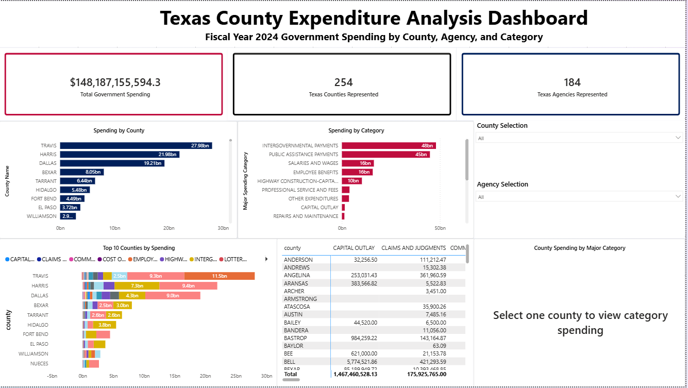

# Texas County Expenditure Analysis

This project analyzes Texas government expenditure data using Python, SQL, and Power BI. The goal is to explore how government spending is distributed across counties, agencies, and major spending categories.

The project demonstrates a full data analytics workflow including data cleaning, SQL analysis, and interactive dashboard development.

---

## Tools Used

- Python (pandas) for data cleaning and preprocessing
- SQL for analytical queries
- Power BI for dashboard visualization
- GitHub for project documentation and version control

---

## Project Workflow

Raw Dataset  
↓  
Python Data Cleaning (pandas)  
↓  
Cleaned Dataset  
↓  
SQL Analysis  
↓  
Power BI Dashboard  

---

## Dashboard Preview



The Power BI dashboard allows users to explore:

- Total government spending
- Spending distribution by county
- Spending distribution by major category
- Top agencies by spending
- Category breakdown within selected counties

Interactive slicers allow filtering by county, agency, and spending category.

---

## Key Analysis Questions

This project explores several analytical questions, including:

- Which Texas counties receive the highest levels of government spending?
- Which major spending categories account for the largest portion of expenditures?
- Which government agencies are responsible for the most spending?
- How do spending priorities differ across counties?

---

## Data Cleaning

The dataset was cleaned using Python and pandas. Cleaning steps included:

- Standardizing column names
- Converting currency values to numeric format
- Handling missing values
- Removing duplicate records
- Preparing the dataset for SQL and Power BI analysis

The cleaned dataset is located in:

```
data/cleaned/texas_county_expenditures_cleaned.csv
```

---

## SQL Analysis

SQL queries were written to explore spending patterns across counties, agencies, and spending categories.

Key analyses include:

- Total spending by county
- Total spending by major category
- Total spending by agency
- Spending by county and category
- County share of total spending
- Top spending categories within counties

The queries are located in:

```
sql/expenditure_analysis_queries.sql
```

---

## Power BI Dashboard

The Power BI dashboard provides an interactive view of the dataset with:

- KPI cards for total spending, counties, and agencies
- Bar charts showing spending by county and category
- A matrix visual comparing category spending across counties
- A pie chart showing spending breakdown for a selected county
- Interactive slicers for filtering the data

Power BI file:

```
powerbi/Texas Counties Expenditure Analysis Dashboard.pbix
```

---

## Purpose

This project demonstrates a complete data analytics pipeline including:

- data preparation
- SQL analysis
- data visualization
- project documentation

The goal is to showcase practical analytics skills using real-world government expenditure data.

---

## Author

Data analytics project created as part of a personal analytics portfolio demonstrating Python, SQL, and Power BI skills.
